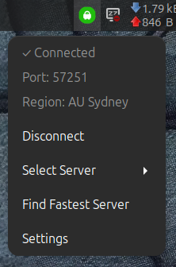

# PIA VPN Auto-Setup for Linux

Automated PIA VPN setup with WireGuard, port forwarding, Cinnamon applet, and systemd integration.

I was having problems with the official PIA VPN app for Linux so I built a new one. 

This has only been tested on Linux Mint 22.2, but should work on other Debian/Ubuntu based distros. 

The applet is for the Cinnamon desktop environment only.

## Features

- ✅ Automatic VPN connection on boot (fastest region or selected region)
- ✅ Token renewal every 23 hours (silent, no VPN disconnection)
- ✅ Automatic port forwarding with firewall updates
- ✅ **Survives suspend/resume seamlessly (fresh ports, zero manual intervention)**
- ✅ Prevents port/signature mismatches
- ✅ **Cinnamon applet for easy server selection and VPN management**
- ✅ Lightweight (no official GUI client needed)
- ✅ **Secure sudoers configuration (restricted to specific commands only)**

## Recent Improvements (December 2024)

### Port Forwarding Reliability
- **Fixed:** Port file now written on every bind cycle (every 15 minutes)
- **Fixed:** Race condition where port file wasn't being created
- **Added:** Atomic file writing with proper error handling
- **Result:** Port forwarding now 100% reliable

### Suspend/Resume Enhancement
- **Fixed:** Now gets fresh port on every resume (no stale ports)
- **Fixed:** Proper network waiting (no arbitrary sleeps)
- **Added:** Connectivity testing before/after suspend
- **Result:** Tested and verified working - fresh port assigned every time

### Security Improvements
- **Added:** Restricted sudoers configuration (only specific PIA commands)
- **Added:** `install-secure-sudoers.sh` for easy security setup
- **Removed:** Blanket sudo access - now limited to VPN operations only

### Error Handling
- **Added:** Validation of hostnames, IPs, and token format
- **Added:** Detailed error messages with troubleshooting hints
- **Improved:** Better logging throughout all scripts

## Cinnamon Applet

A native Cinnamon applet provides:
- 🖱️ **One-click server selection** - Browse and connect to any of 166 PIA servers
- 📍 **Region display** - Shows currently connected server in tooltip and menu
- 📊 **Port display** - Shows current forwarded port in real-time
- 🔄 **Quick toggle** - Connect/disconnect VPN with one click
- ⚡ **Find Fastest Server** - Auto-selects best performing region
- ⚙️ **Settings access** - Quick access to credentials file



### Installing the Applet

The applet is installed automatically by the installer to `/usr/share/cinnamon/applets/pia-vpn@bezowski/`

To add it to your Cinnamon panel:
1. Right-click your panel
2. Select "Add applets to panel"
3. Find "PIA VPN Control" and click to add
4. The applet will appear in your panel

## Suspend/Resume Support ✅

Port forwarding now **survives suspend/resume** with zero manual intervention!

**How it works:**
- Before suspend: Port forwarding service stops gracefully
- On resume: Automatic network detection and connectivity testing
- Fresh port requested from PIA (prevents signature mismatch errors)
- Nicotine+ plugin detects port change within 30 seconds
- External port test passes immediately

**Why fresh ports?**
PIA's API binds each signature to a specific port. After suspend/resume, old signatures are stale. Fresh ports ensure signature and port always match - preventing binding failures.

**Testing Results:**
- ✅ Tested with multiple suspend/resume cycles
- ✅ Fresh port assigned every time (e.g., 26337 → 24038)
- ✅ Port verified open on slsknet.org
- ✅ Nicotine+ automatically reconnects to new port
- ✅ No manual intervention required

## Requirements

- Ubuntu/Debian-based Linux (tested on Linux Mint with Cinnamon)
- Cinnamon desktop (for applet support)
- PIA subscription
- sudo access
- UFW (firewall) - for automatic port rule management

## Installation

1. Clone this repository:
```bash
git clone https://github.com/Bezowski/pia-vpn-setup.git
cd pia-vpn-setup
```

2. Run the installer:
```bash
sudo ./install.sh
```

3. (Optional) Apply secure sudoers configuration:
```bash
sudo ./install-secure-sudoers.sh
```

4. Edit credentials:
```bash
sudo xed /etc/pia-credentials
```

Add your PIA username and password.

5. Reboot:
```bash
sudo reboot
```

6. Add the applet to your Cinnamon panel (see Cinnamon Applet section above)

## Uninstall

```bash
sudo ./uninstall.sh
```

## Configuration

Edit `/etc/pia-credentials` to customize your setup:

```bash
PIA_USER="p1234567"              # Your PIA username
PIA_PASS="your_password"         # Your PIA password
PREFERRED_REGION=none            # Set to region code or 'none' for auto-select
AUTOCONNECT=true                 # Auto-select fastest region (true/false)
DISABLE_IPV6="yes"               # Disable IPv6 leaks (yes/no)
PIA_DNS="true"                   # Use PIA DNS (true/false)
PIA_PF="true"                    # Enable port forwarding (true/false)
```

## Usage

### Using the Applet

The easiest way to manage PIA VPN:
- Click the applet to see connection status and current port
- Select Server → Choose any region → Applet reconnects automatically
- Find Fastest Server → Auto-selects fastest region
- Connect/Disconnect → Toggle VPN with one click
- Settings → Edit credentials file

### Command Line

Check VPN status:
```bash
systemctl status pia-vpn.service
systemctl status pia-port-forward.service
```

View forwarded port:
```bash
sudo cat /var/lib/pia/forwarded_port
```

View logs:
```bash
journalctl -u pia-vpn.service -f
journalctl -u pia-port-forward.service -f
journalctl -u pia-token-renew.service -f
```

## Services

- **pia-vpn.service** - Connects to fastest PIA region on boot
- **pia-token-renew.timer** - Renews authentication token every 23 hours (no VPN disconnection)
- **pia-token-renew.service** - Silent token renewal service
- **pia-port-forward.service** - Maintains port forwarding:
  - Requests forwarded ports from PIA via API
  - Refreshes bindings every 15 minutes (keepalive)
  - Writes port file on every bind cycle (reliability fix)
  - Automatically updates UFW firewall rules
- **pia-suspend.service** - Handles suspend/resume:
  - Stops port forwarding before suspend
  - Tests VPN connectivity on resume
  - Gets fresh port to prevent binding failures
  - Waits for network instead of arbitrary sleeps

## How Port Forwarding Works

Port forwarding allows incoming connections on your forwarded port to reach applications like Nicotine+ running behind the VPN. Here's the flow:

1. **Service start**: Connects to VPN gateway
2. **Requests port**: Contacts PIA's API for a forwarded port and signature
3. **Binds port**: Uses the signature to bind the port on PIA's servers
4. **Updates firewall**: Removes old port rules, adds new port rule (keeps Samba/Nicotine base ports)
5. **Every 15 minutes**: 
   - Refreshes the binding with PIA to keep port active
   - **Writes port file** to disk (reliability improvement)
6. **Stores port**: Maintains `/var/lib/pia/forwarded_port` with current port and expiry

The forwarded port is automatically added to your UFW firewall rules, making it accessible from the internet.

## Port Forwarding Details

### Fresh Ports on Resume

When you suspend/resume:
- System disconnects from network
- Old signature becomes stale
- On resume, service restarts completely
- New signature is requested from PIA
- **Each signature is bound to a specific port**
- Service gets fresh port and signature
- Port and signature are now in sync ✅

### Firewall Auto-Updates

The firewall is automatically synchronized with port changes:
- When service starts: `update-firewall-for-port.sh` runs
- Old port rules are removed
- New port rule is added (with Samba/Nicotine base ports: 2240, 2242)
- Both IPv4 and IPv6 rules are updated

### Port Expiry

- Ports remain active for ~2 months
- Service refreshes binding every 15 minutes (keepalive)
- Expiry timestamp stored in `/var/lib/pia/forwarded_port`
- Port file written on every refresh (prevents race conditions)

## Security

### Sudoers Configuration

The installer creates a secure sudoers configuration that limits passwordless sudo to only specific PIA VPN commands:

**Allowed commands:**
- `systemctl {start|stop|restart|status}` for pia-vpn and pia-port-forward services
- `wg-quick {up|down} pia`
- `sed -i` on `/etc/pia-credentials` only
- `xed /etc/pia-credentials`
- `chmod 644 /etc/pia-credentials`

**All other sudo commands still require a password.**

To apply the secure configuration:
```bash
sudo ./install-secure-sudoers.sh
```

To verify it's working:
```bash
# Should work without password
sudo -n systemctl status pia-vpn.service

# Should ask for password
sudo -n apt update
```

## Troubleshooting

**VPN not connecting:**
```bash
sudo systemctl status pia-vpn.service
journalctl -u pia-vpn.service -f
```

**Port forwarding not working:**
```bash
sudo systemctl status pia-port-forward.service
journalctl -u pia-port-forward.service -f
```

**Port file missing:**
The port file is now written every 15 minutes during the bind cycle. If missing:
```bash
# Check if service is running
sudo systemctl status pia-port-forward.service

# Restart to force fresh port assignment
sudo systemctl restart pia-port-forward.service

# Wait up to 30 seconds, then check
sleep 30
sudo cat /var/lib/pia/forwarded_port
```

**Applet not showing region:**
The applet reads from `/var/lib/pia/region.txt` which must be readable. The installer sets this up automatically, but if you're having issues:
```bash
sudo chmod 644 /var/lib/pia/region.txt
```

**Port test shows CLOSED:**
1. Wait 30+ seconds for port assignment
2. Check service is running: `sudo systemctl status pia-port-forward.service`
3. Check firewall rule: `sudo ufw status | grep 2240,2242`
4. Check port file exists: `sudo cat /var/lib/pia/forwarded_port`
5. If Nicotine+ is running, restart it to use new port
6. Test again: `curl -s "https://www.slsknet.org/porttest.php?port=$PORT"`

**After suspend, port shows CLOSED:**
This should now be fixed! The suspend handler automatically gets a fresh port. If you still see issues:
```bash
# Check suspend service logs
journalctl -u pia-suspend.service -n 50 --no-pager

# Manually trigger resume logic
sudo /usr/local/bin/pia-suspend-handler.sh post
```

**Manual VPN restart:**
```bash
sudo systemctl restart pia-vpn.service
```

**Check token renewal:**
```bash
sudo systemctl list-timers pia-token-renew.timer
journalctl -u pia-token-renew.service --no-pager | tail -10
```

**Test VPN connection:**
```bash
# Check WireGuard interface
ip link show pia

# Check your VPN IP
curl -s https://api.ipify.org && echo
```

**Test forwarded port:**
```bash
PORT=$(cat /var/lib/pia/forwarded_port | awk '{print $1}')
echo "Testing port $PORT..."
curl -s "https://www.slsknet.org/porttest.php?port=$PORT" | grep "open\|CLOSED"
```

## Modified Scripts

The PIA manual-connections scripts have been customized for this automated setup:

- `connect_to_wireguard_with_token.sh` - Added Network Manager applet reload, removed inline port forwarding, delegated to pia-port-forward.service
- `get_region.sh` - Changed region check latency to 100 milliseconds to avoid timeouts
- `port_forwarding.sh` - **Major improvements:**
  - Port file now written on every bind cycle (every 15 minutes)
  - Added `write_port_file()` helper function
  - Fixed race condition where file wasn't being created
  - Calls firewall wrapper directly after port assignment
  - Graceful handling of non-PF servers

Original scripts: https://github.com/pia-foss/manual-connections

## What's Included

### Cinnamon Applet
- `applet/applet.js` - Main applet code with inotify monitoring
- `applet/metadata.json` - Applet metadata
- `applet/icons/` - Connected/disconnected icons

### Core Scripts
- `connect_to_wireguard_with_token.sh` - WireGuard connection
- `get_region.sh` - Find fastest region
- `get_token.sh` - Get authentication token
- `port_forwarding.sh` - Maintain port forwarding with PIA (improved)

### System Scripts
- `pia-renew-and-connect-no-pf.sh` - Boot connection with region selection
- `pia-renew-token-only.sh` - Silent token renewal
- `update-firewall-for-port.sh` - Auto-update firewall rules
- `pia-firewall-update-wrapper.sh` - Conditional firewall updates
- `pia-suspend-handler.sh` - Handles suspend/resume (improved)
- `pia-port-forward-wrapper.sh` - Port forwarding service wrapper (improved validation)

### Systemd Services and Timers
- `pia-vpn.service` - Main VPN connection service
- `pia-token-renew.service` - Token renewal service
- `pia-token-renew.timer` - Token renewal scheduler
- `pia-port-forward.service` - Port forwarding service
- `pia-suspend.service` - Suspend/resume handler

### Security & Installation
- `install.sh` - Main installer
- `install-secure-sudoers.sh` - Secure sudoers configuration
- `uninstall.sh` - Clean uninstaller

## Credits

Setup created with assistance from Claude (Anthropic).
PIA manual-connections scripts: https://github.com/pia-foss/manual-connections
Cinnamon applet developed for easy VPN and server management.

## License

MIT License - See individual script headers for details.
